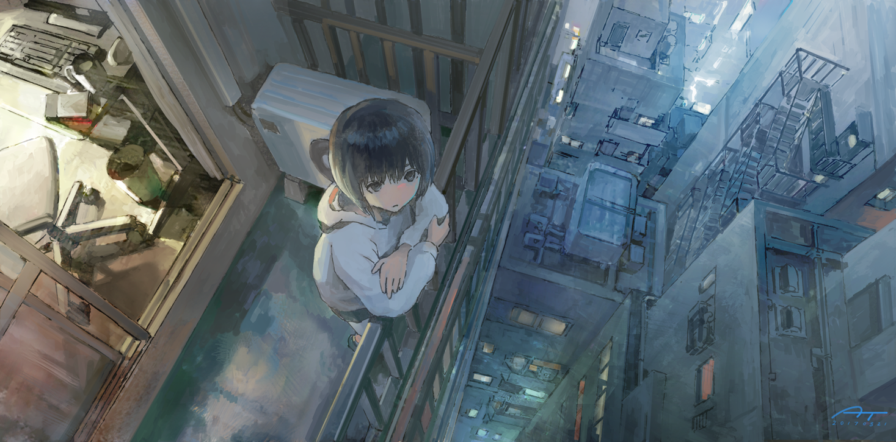

### Hi there! I'm xingjian!

* **Education:** Majoring in **Mathematics**.
* **Interests:** Currently exploring **Machine Learning**, **Deep Learning**, and **Linux** systems.
* **Skills:** Passionate about **Programming**, primarily using **Python** for problem-solving.

### Contact Me

* **Email:** github@lsgbin.com

---

<picture>
  <source media="(prefers-color-scheme: dark)" srcset="https://github.com/timetetng/timetetng/blob/output/github-contribution-grid-snake-dark.svg" />
  <source media="(prefers-color-scheme: light)" srcset="https://github.com/timetetng/timetetng/blob/output/github-contribution-grid-snake.svg" />
  
</picture>

