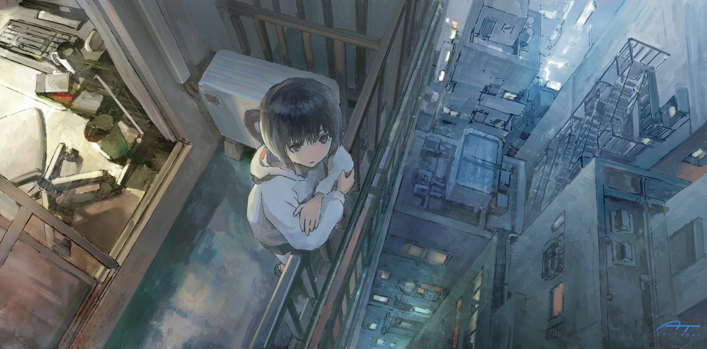

 
  
![hello there!][github-sub-title:img]

### 👋 𝐻i there! 𝐼'𝓂 @𝓉𝒾𝓂𝑒𝓍𝒾𝓃𝑔𝒿𝒾𝒶𝓃

[github-sub-title:img]: https://readme-typing-svg.herokuapp.com?font=Segoe+Script&center=true&lines="hello%20from%20time行简"
欢迎来到我的 GitHub 主页！

* 🧠 我是一名主修 **数学** 的学生。
* 🤖 我目前对 **LLM** 和 **Linux** 比较感兴趣，正在积极探索相关技术。
* 💻 我也喜欢 **编程**，用 **Python** 解决各种问题。

### 📫 如何联系我

* **Email:** github@lsgbin.com
 
---

 

 

<!-- 放置贪吃蛇游戏 -->
<picture>
<!-- 根据主题颜色来决定用亮的还是黑的 -->
  <source media="(prefers-color-scheme: dark)" srcset="https://github.com/timetetng/timetetng/blob/output/github-contribution-grid-snake-dark.svg" />
  <source media="(prefers-color-scheme: light)" srcset="https://github.com/timetetng/timetetng/blob/output/github-contribution-grid-snake.svg" />
  
</picture>

